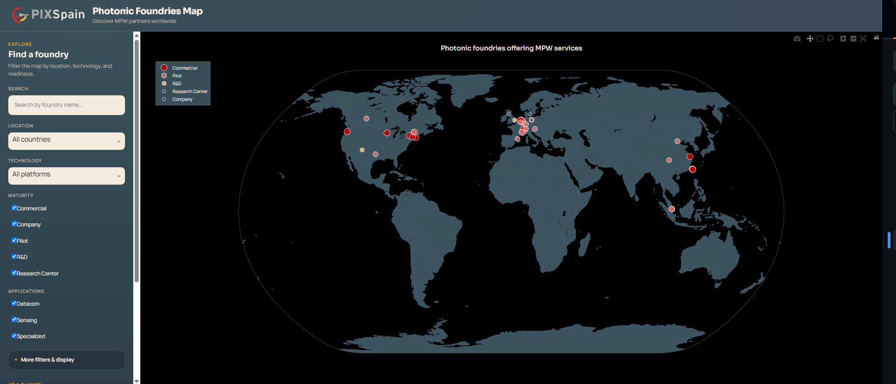
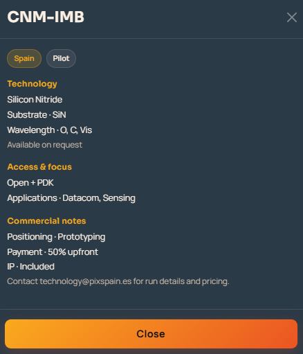

# Integrated Optical Foundries 2026 - Interactive World Map

An interactive, dynamic world map application displaying the locations, activities, and capabilities of Integrated Optical Foundries in 2026.


## Features

### 🌍 Interactive World Map
- **Clickable markers** for each foundry with detailed information
- **Smooth zooming and panning** with natural earth projection
- **Hover tooltips** showing key foundry information
- **Dark mode** optimized UI for professional visualization

### 🔍 Dynamic Filtering
- **Search bar** with fuzzy matching for foundry names
- **Country/Region filter** - multi-select dropdown
- **Technology category filter** - filter by SiPh, InP, LN, SiN, etc.
- **Production maturity filter** - Commercial, Pilot, R&D, Pilotline
- **Application domain filter** - Datacom, Sensing, Specialized, etc.

### 🎨 Customization
- **Color by** - Type, Technology Category, or Access Model
- **Size by** - Type or Technology Count
- **Heatmap overlay** - Visualize foundry density (optional)

### 📊 Additional Features
- **Real-time statistics** - Updated based on active filters
- **Export to CSV** - Download filtered data
- **Detailed popup panels** - Click any marker for full foundry profile
- **Comparison mode** - Compare multiple foundries side-by-side



## Installation

### Prerequisites
- Python ≥ 3.10
- pip package manager

### Setup

1. **Navigate to the ICFoundries directory:**
   ```bash
   cd ICFoundries
   ```

2. **Install dependencies:**
   ```bash
   pip install -r requirements.txt
   ```

   Or install individually:
   ```bash
   pip install dash dash-bootstrap-components pandas plotly numpy
   ```

## Running the Application

### Start the server:
```bash
python app.py
```

The application will start on `http://127.0.0.1:8050`

Open this URL in your web browser to view the interactive map.

### Alternative: Run individual modules

**Test data loading:**
```bash
python data_ingestion.py
```

**Test geocoding:**
```bash
python geocoding.py
```

## Project Structure

```
ICFoundries/
├── app.py                 # Main application entry point
├── data_ingestion.py      # Data parsing and structuring
├── geocoding.py           # Location geocoding with caching
├── map_view.py            # Interactive map visualization
├── ui_components.py       # Dash UI components
├── requirements.txt       # Python dependencies
└── README.md             # This file
```

## Data Sources

The application uses data extracted from three authoritative source images containing information about:
- **40 Integrated Optical Foundries** worldwide
- Foundry locations, technologies, substrates, and capabilities
- Production schedules and access models
- Technology categories and application domains

## Usage Guide

### Basic Navigation
1. **View all foundries** - The map loads with all 40 foundries displayed
2. **Click a marker** - Opens detailed popup with full foundry information
3. **Hover over markers** - See quick summary in tooltip
4. **Zoom and pan** - Use mouse wheel and drag to navigate

### Filtering
1. **Search** - Type in the search bar to find specific foundries
2. **Select filters** - Use dropdowns and checkboxes in the sidebar
3. **Change visualization** - Use "Color By" and "Size By" radio buttons
4. **View statistics** - Check the stats panel for filtered results

### Export Data
1. Apply desired filters
2. Click "Export to CSV" button
3. File will be saved as `foundries_export.csv` in the current directory

## Technology Stack

- **Dash** - Web framework for Python
- **Plotly** - Interactive graphing library
- **Pandas** - Data manipulation and analysis
- **Dash Bootstrap Components** - UI component library
- **NumPy** - Numerical computing

## Data Fields

Each foundry entry includes:
- **Basic Info**: Name, Country, Location (lat/lon)
- **Technology**: Substrate, Technologies, Wavelength, Category
- **Business**: Type, Access Model, Applications
- **Schedule**: Monthly availability (where available)

## Customization

### Adding New Foundries
Edit `data_ingestion.py` and add entries to the `foundries` list in `load_foundry_data()`.

### Updating Coordinates
Edit `geocoding.py` and add entries to `FOUNDRY_COORDINATES` dictionary.

### Changing Colors
Modify `COLOR_SCHEME` dictionary in `map_view.py`.

## Troubleshooting

### Port Already in Use
If port 8050 is occupied, modify the port in `app.py`:
```python
app.run_server(debug=True, host='127.0.0.1', port=8051)
```

### Missing Dependencies
Ensure all packages are installed:
```bash
pip install --upgrade -r requirements.txt
```

### Data Not Loading
Check that `data_ingestion.py` runs without errors:
```bash
python data_ingestion.py
```

## Future Enhancements

Potential additions:
- Timeline slider for evolution tracking
- Enhanced heatmap visualization
- Side-by-side comparison mode
- Screenshot/export functionality
- Additional data fields
- Real-time updates from external APIs

## License

This project is provided as-is for research and educational purposes.

## Contact

For questions or issues, please refer to the project documentation or contact the development team.

---

**Version**: 1.0.0  
**Last Updated**: 2026  
**Python Version**: ≥3.10

